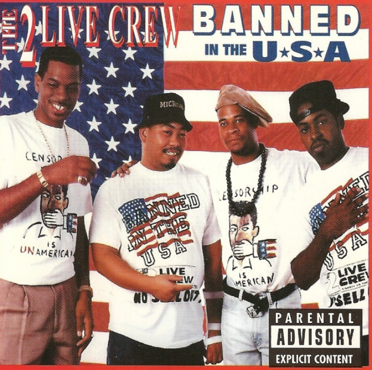
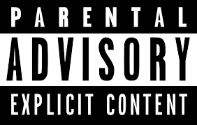

```{r setup, include=FALSE}
knitr::opts_chunk$set(echo = TRUE)
```

"lyrics.csv" is a filtered corpus of 380,000+ song lyrics from from MetroLyrics. You can read more about it on [Kaggle](https://www.kaggle.com/gyani95/380000-lyrics-from-metrolyrics).

"artists.csv" provides the background information of all the artistis. These information are scraped from [LyricsFreak](https://www.lyricsfreak.com/).

In this R notebook, we process the raw textual data for our data analysis.

### Step 0 - Load all the required libraries

From the packages' descriptions:

+ `tm` is a framework for text mining applications within R;
+ `data.table` is a package for fast aggregation of large data;
+ `tidyverse` is an opinionated collection of R packages designed for data science. All packages share an underlying design philosophy, grammar, and data structures;
+ `tidytext` allows text mining using 'dplyr', 'ggplot2', and other tidy tools;
+ `DT` provides an R interface to the JavaScript library DataTables.

```{r, message=FALSE, warning=FALSE,echo=FALSE}
packages.used=c("tm", "tidytext","tidyverse","DT","wordcloud","scales","gridExtra","ngram","igraph","ggraph","rsconnect", "data.table","plotly","wordcloud2","shiny","ggplot2", "formattable", "plyr")

# check packages that need to be installed.
packages.needed=setdiff(packages.used, 
                        intersect(installed.packages()[,1], 
                                  packages.used))
# install additional packages
if(length(packages.needed)>0){
  install.packages(packages.needed, dependencies = TRUE)
}


library(tm)
library(data.table)
library(tidytext)
library(tidyverse)
library(DT)
library(plotly)
library(scales)
library(wordcloud2)
library(gridExtra)
library(ngram)
library(shiny) 
library(ggplot2)
library(wordcloud)
library(formattable)


```

### Step 1 - Load the data to be cleaned and processed

```{r}
# load lyrics data
load('../data/lyrics.RData') 
```


### Step 2 - Preliminary cleaning of text

We clean the text by converting all the letters to the lower case, and removing punctuation, numbers, empty words and extra white space.

```{r text processing in tm}
# function for removimg leading and trailing whitespace from character strings 
leadingWhitespace <- content_transformer(function(x) str_trim(x, side = "both"))
# remove stop words
data("stop_words")
word <- c("lot", "today", "months", "month", "wouldnt", "wasnt", "ha", "na", "ooh", "da", "im", "la", "oi", "year", "years", "last", "past", "dont","youre","aint","wont","yeah","hey","gotta", "wanna","gonna", "ive", "youve", "youll", "ill", "yall","yo", "em", "uh", "she", "shes", "he", "hes", "ya")
stop_words <- c(stop_words$word, word)
# clean the data and make a corpus
corpus <- VCorpus(VectorSource(dt_lyrics$lyrics))%>%
  tm_map(content_transformer(tolower))%>%
  tm_map(removePunctuation)%>%
  tm_map(removeWords, character(0))%>%
  tm_map(removeWords, stop_words)%>%
  tm_map(removeNumbers)%>%
  tm_map(stripWhitespace)%>%
  tm_map(leadingWhitespace)
```


### Step 3 - Stemming words and converting tm object to tidy object

Stemming reduces a word to its word *stem*. We stem the words here and then convert the "tm" object to a "tidy" object for much faster processing.

```{r stemming}
stemmed <- tm_map(corpus, stemDocument) %>%
  tidy() %>%
  select(text)
```

### Step 4 - Creating tidy format of the dictionary to be used for completing stems

We also need a dictionary to look up the words corresponding to the stems.

```{r tidy dictionary}
dict <- tidy(corpus) %>%
  select(text) %>%
  unnest_tokens(dictionary, text)
```

### Step 5 - Combining stems and dictionary into the same tibble

Here we combine the stems and the dictionary into the same "tidy" object.

```{r, tidy stems with dictionary, warning=FALSE, message=FALSE}
completed <- stemmed %>%
  mutate(id = row_number()) %>%
  unnest_tokens(stems, text) %>%
  bind_cols(dict) 
```

### Step 6 - Stem completion

Lastly, we complete the stems by picking the corresponding word with the highest frequency.

```{r stem completion, warning=FALSE, message=FALSE}
completed <- completed %>%
  group_by(stems) %>%
  count(dictionary) %>%
  mutate(word = dictionary[which.max(n)]) %>%
  ungroup() %>%
  select(stems, word) %>%
  distinct() %>%
  right_join(completed) %>%
  select(-stems)
```

### Step 8 - Pasting stem completed individual words into their respective lyrics

We want our processed words to resemble the structure of the original lyrics. So we paste the words together to form processed lyrics.

```{r reverse unnest}
completed <- completed %>%
  group_by(id) %>%
  summarise(stemmedwords= str_c(word, collapse = " ")) %>%
  ungroup()
```

### Step 9 - Keeping a track of the processed lyrics with their own ID

```{r cleaned hm_data, warning=FALSE, message=FALSE}
dt_lyrics <- dt_lyrics %>%
  mutate(id = row_number()) %>%
  inner_join(completed)
```

### Exporting the processed text data into a CSV file

```{r export data}
save(dt_lyrics, file="../output/processed_lyrics.RData")
```

### Load the processed lyrics data along with artist information

We use the processed data and artist information for our analysis.

```{r load data, warning=FALSE, message=FALSE}
# load lyrics data
load('../output/processed_lyrics.RData') 
# load artist information
dt_artist <- fread('../data/artists.csv') 
```


```{r , warning=FALSE, message=FALSE,echo=FALSE}

# Preparations for visualization
lyrics_list <- c("Folk", "R&B", "Electronic", "Jazz", "Indie", "Country", "Rock", "Metal", "Pop", "Hip-Hop", "Other")
time_list <- c("1970s", "1980s", "1990s", "2000s", "2010s")


corpus <- VCorpus(VectorSource(dt_lyrics$stemmedwords))
word_tibble <- tidy(corpus) %>%
  select(text) %>%
  mutate(id = row_number()) %>%
  unnest_tokens(word, text)
```


<center>


</center>


## The Power of music

Have you ever laid on a rock besides a rumbling waterfall looking deep into the clear blue sky on a warm summer afternoon? I bet the serenity of it all takes your into dreamland before you can bat your eyes twice!

How about sitting under a shaddy green tree in a valley far from civilization where only the humming of the mockingbird, the chattering of the squirrel, the shaffling of the tree leaves, seem to create music just for you and you alone?

Music is powerful, both in nature and in man made melodies. It changes lives - no wonder man has tried over the years to harnes it's power to influence other men. This has become even more pronounced since technology to record and distribute music has been developed and sharpened. On the bright side, by analzing music lyrics from the www.kaggle.com website for the period 1968 to 2016, it's clear that the most commonly said word in music lyrics is "LOVE". The word pops out in the wordcloud below! 

```{r, warning=FALSE, message=FALSE,echo=FALSE}

n_words<-count(word_tibble, word, sort = TRUE)
n_words %>%
  slice(1:100) %>%
  wordcloud2(size = 0.6,
             rotateRatio = 0.2)
```

In fact, the word "LOVE" appears 194,052 times in the lyrics that were analyzed. 

Other most frequent words in lyrics are shown in the graph below. We can infere that most of these words have to do with men singing "LOVE" songs to their "GIRLs / BABY's". 

```{r, warning=FALSE, message=FALSE,echo=FALSE}
n_words[1:10,] %>%
  mutate(word = reorder(word, n)) %>%
  ggplot(aes(word, n)) +
  geom_col(fill="orange") +
  labs(title = "Word Frequency in Music Lyrics")+
  xlab(NULL) +
  ylab("Word Frequency")+
  coord_flip()

```

A comparative wordcloud for the five genres (Country, Rock, Metal, Pop and Hip-Hop) with the most number of words is shown below.


```{r, warning=FALSE, message=FALSE, echo=FALSE}

words_folk<-filter(word_tibble, id %in% which(dt_lyrics$genre == "Folk"))
words_R.B<-filter(word_tibble, id %in% which(dt_lyrics$genre == "R&B"))
words_electronic<-filter(word_tibble, id %in% which(dt_lyrics$genre == "Electronic"))
words_jazz<-filter(word_tibble, id %in% which(dt_lyrics$genre == "Jazz"))
words_indie<-filter(word_tibble, id %in% which(dt_lyrics$genre == "Indie"))
words_country<-filter(word_tibble, id %in% which(dt_lyrics$genre == "Country"))
words_rock<-filter(word_tibble, id %in% which(dt_lyrics$genre == "Rock"))
words_metal<-filter(word_tibble, id %in% which(dt_lyrics$genre == "Metal"))
words_pop<-filter(word_tibble, id %in% which(dt_lyrics$genre == "Pop"))
words_HipHop<-filter(word_tibble, id %in% which(dt_lyrics$genre == "Hip-Hop"))
words_other<-filter(word_tibble, id %in% which(dt_lyrics$genre == "Other"))


a<-c(length(words_folk$word), length(words_R.B$word),length(words_electronic$word), length(words_jazz$word), length(words_indie$word), length(words_country$word), length(words_rock$word), length(words_metal$word), length(words_pop$word), length(words_HipHop$word), length(words_other$word))

b<-c((length(unique(words_folk$id))), length(unique((words_R.B$id))), length(unique((words_electronic$id))), length(unique((words_jazz$id))), length(unique((words_indie$id))), length(unique((words_country$id))), length(unique((words_rock$id))), length(unique((words_metal$id))), length(unique((words_pop$id))), length(unique((words_HipHop$id))), length(unique((words_other$id))))

c<-round(a/b, digits = 0)

genre_stats<-matrix(c(a,b,c), ncol=3, byrow=FALSE)

rownames(genre_stats)<-c("Folk", "R&B", "Electronic", "Jazz", "Indie", "Country", "Rock", "Metal", "Pop", "Hip-Hop", "Other")
colnames(genre_stats)<-c("Total Words", "Number of songs", "Mean Words Per Song")


## Combining words 
words_country_1<-paste(words_country$word, collapse=" ")
words_rock_1<-paste(words_rock$word, collapse=" ")
words_metal_1<-paste(words_metal$word, collapse=" ")
words_pop_1<-paste(words_pop$word, collapse=" ")
words_HipHop_1<-paste(words_HipHop$word, collapse=" ")


all_combined<-c(words_country_1, words_rock_1, words_metal_1, words_pop_1, words_HipHop_1)

# create corpus
corpus2 = Corpus(VectorSource(all_combined))

# create term-document matrix
tdm = TermDocumentMatrix(corpus2)

# convert as matrix
tdm = as.matrix(tdm)

# adding column names
colnames(tdm) = c("Country", "Rock", "Metal", "Pop", "Hip-Hop")

# comparison cloud
comparison.cloud(tdm, random.order=FALSE, 
                 match.colors=TRUE,
                 title.size=1.5, max.words=200,
                 backgroundColor = "orange")

```

The coparative wordcloud reveals that the most common words for these five genres differ a lot. Words that pop out for Country music are HOME, NIGHT, BLUE, and COUNTRY.  Metal is more dark, with words like DEATH, BLOOD, PAIN AND SOUL sticking out more. Pop is mostly about LOVE, BABY, HEART, GIRL and FEEL. Hip-Hop, on the other hand, has explicit words as the most common words; the words just hit you in the face just like that! It is these words in Hip-Hop that caught my attention to want to analyze the prevalence of explicit language in lyrics.


## Why explicit languare in music lyrics

<center>



</center>


Zach Schonfeld in his [Newsweek article of 11/10/2015](https://www.newsweek.com/does-parental-advisory-label-still-matter-tipper-gore-375607) writes, "In 2015, teenagers aren't waiting in line at Sam Goody to pick up the Kendrick album; they're streaming it or grabbing it on iTunes, and a warning label directed at parents has as much sway as an "I Am Under 18" button on a porn site." The internet has generally made it more difficult for regulatory bodies to enforce regulations that bar underaged individuals from accessing certian media that is not meant for their consumption. With this lack of regulation, young people - who drive demand for certain music genres - makes it easier for musicians to tailor their lyrical message to appeal to that segment of society that has a burning desire to rebel from the norms of yesteryear. In analyzing this data, my inclination was that because of the easy access to any kinds of music with any kinds of lyrics on the internet, the prevalence of explicit content in music lyrics would increase over time.


First of all, I compared the number of explicit words in lyrics for each genre. We will use the list of explicit words found [here](http://www.bannedwordlist.com/lists/swearWords.txt).


```{r, warning=FALSE, message=FALSE, echo=FALSE}
bad_word <- fread('../data/swearWords.csv')
bad_word<-paste(bad_word, sep =" ")%>%
  gsub('[[:punct:]]+','',.)%>%
  gsub("\n","",.)%>%
  strsplit(split = " ")%>%
  unlist


### Bad words by genre

cloud_function<-function(WordData){
  num_words<-count(WordData, word) %>%
    filter(word  %in% bad_word) 
  sum(num_words$n)
}


bad_word_vector<-vector()
for (i in lyrics_list){
  no_bad_words<-cloud_function(filter(word_tibble, id %in% which(dt_lyrics$genre == i))) # Bad words per genre
  bad_word_vector<-cbind(bad_word_vector,no_bad_words)
}

bad_word_vector<-as.data.frame(bad_word_vector[1:11])


ggplot(data=bad_word_vector)+
  geom_col(mapping=aes(x=lyrics_list, y=bad_word_vector[,1]), fill="orange", show.legend = NA)+
  labs(title = "Bad Words in Lyrics - by Genre",x="Genre",y="Frequency")+
  theme(axis.text.x = element_text(angle = 60, hjust = 1))

```


It is evident from the graph above that Hip-Hop lyrics contain the most number of explicit words. Could this be because Hip-Hop had the most number of songs over the referemce period? To answer this question I tallied the number of songs per genre and plotted the graph below:


```{r, warning=FALSE, message=FALSE, echo=FALSE}

songs_per_genre <- summary(factor(dt_lyrics$genre))%>%
  tibble::enframe()


colnames(songs_per_genre)<-c("Genre", "Number of songs")

ggplot(data=songs_per_genre)+
  geom_col(mapping=aes(x=songs_per_genre$Genre, y=songs_per_genre$`Number of songs`), fill="orange", show.legend = NA)+
  labs(title = "Total Number of Songs - by Genre",x="Genre",y="Number of Songs")+
  theme(axis.text.x = element_text(angle = 60, hjust = 1))

```

Clearly Rock songs ecclipsed all the other genres in terms of the total number of songs produced. In fact, the number of Rock songs was more than the combined number of songs of all the other genres. So how come the number of explicit words in Hip-Hop lyrics was so much more than the total number of explicit words in all other genres? One explanation could be the number of words in each Hip-Hop song: Hip-Hop songs averaged 191 words per song (excluding stopwords) compared to an average of 85 words per song for the genre that comes second (see table below). 

```{r, warning=FALSE, message=FALSE, echo=FALSE}

# Creating color
customGreen0 = "#DeF7E9"
customGreen = "#71CA97"
customRed = "#ff7f7f"

table_stats<-as.table(genre_stats)
formattable(table_stats,
            align =c("l","c","c","c"),
            "Total Words"= color_tile(customGreen, customGreen0),
            "Number os songs"= color_tile(customGreen, customGreen0),
            "Mean Words Per Song"= color_tile(customGreen, customGreen0))
```


Before zooming in on Hip-Hop, I thought it necessary to visualize the total number of songs over the years. My reasoning for wanting a time series visual display was that the world has become more liberal with passage of time. If more songs are produced in a more liberal world than earlier years, then surely we would expect the number of explict words to be more in the later years than in the earlier years. It seems plausible to assume that the bar for regulating explicit content in musical lyrics has gone down today than 50 years ago. For instance, there are people today who don't see the relevence of the Motion Picture Association of America (MPAA), the body responsible for film ratings. They feel strongly that there is no need to warn viewers in advance about the explicit or violent content of movies. David Chen, for example, writes on his [website](https://www.slashfilm.com/mpaa-rating-nc-17-blue-valentine-tillman-story-kings-speech/): "It's time for more people to condemn the MPAA and their outrageous antics. We're heading towards an age when we don't need a mommy-like organization to dictate what our delicate sensibilities can and can't be exposed to..." His views seem not to be unique to him, but there is a general liberal mentality among youths today, which is why I expect explicit lyrics to increase as time goes by. 

Now, back to the data, the graph below shows the number of songs produced over the years (I deliberately drew a bar graph instead of a line graph in order to point out some interesting years on the graph).


```{r, warning=FALSE, message=FALSE,echo=FALSE}
songs_per_year<-summary(factor(dt_lyrics$year))%>%
  tibble::enframe()

colnames(songs_per_year)<-c("Year", "Number of songs")
songs_per_year<-songs_per_year %>% filter(Year != c(112,702))


ggplot(data=songs_per_year)+
  geom_col(mapping=aes(x=songs_per_year$Year, y=songs_per_year$`Number of songs`), fill="orange", show.legend = NA)+
  labs(title = "Number of Songs - by Year",x="Year",y="Number of Songs")+
  theme(axis.text.x = element_text(angle = 90, hjust = 1))


```


The graph shows that the number of songs generally increased untill around 2005, and then spiked in 2006 and 2007, and 2008, before leveling off in subsequent years.


## The years 2006, 2007 and 2008

Splitting the years 2006 to 2008 by genre produces the graph below.


```{r, warning=FALSE, message=FALSE,echo=FALSE}
bad_word_vector<-vector()
for (i in lyrics_list){
  no_bad_words<-cloud_function(filter(word_tibble, id %in% which(dt_lyrics$genre == i & dt_lyrics$year %in% c(2006,2007,2008)))) # Bad words per genre
  bad_word_vector<-cbind(bad_word_vector,no_bad_words)
}

bad_word_vector<-as.data.frame(bad_word_vector[1:11])


ggplot(data=bad_word_vector)+
  geom_col(mapping=aes(x=lyrics_list, y=bad_word_vector[,1]), fill="orange", show.legend = NA)+
  labs(title = "Bad Words in Lyrics during 2006 - 2008 (by Genre)",x="Genre",y="Frequency")+
  theme(axis.text.x = element_text(angle = 60, hjust = 1))

```


Zeroing in on Hip-Hop, we get this scary looking wordcloud:

```{r, warning=FALSE, message=FALSE, echo=FALSE}

# Final wordcloud for Hip-Hop

cloud_function<-function(WordData){
count(WordData, word, sort = TRUE) %>%
  slice(1:300) %>%
  wordcloud2(size = 0.6,
            rotateRatio = 0.2)
}

# cloud_function(filter(word_tibble, id %in% which(dt_lyrics$genre == "Hip-Hop")))

```

<center>


</center>


Could that be because more Hip-Hop songs were released during the period 2006-2008?

```{r, warning=FALSE, message=FALSE, echo=FALSE}
# Number of songs during the period 2006 to 2008


dt_lyrics_2006_2008<-dt_lyrics %>%
  filter(year %in% 2006:2008)

library(plyr)

songs_2006_2008<-function(required_dt)
  return(sum(summary(factor(required_dt$year))))

num_songs_2006_2008<-ddply(dt_lyrics_2006_2008, .(genre),songs_2006_2008)

colnames(num_songs_2006_2008)<-c("Genre", "Number of songs")


ggplot(data=num_songs_2006_2008)+
  geom_col(mapping=aes(x=num_songs_2006_2008$Genre, y=num_songs_2006_2008$`Number of songs`), fill="orange", show.legend = NA)+
  
  labs(title = "Number of songs during 2006 - 2008 (by Genre)",x="Genre",y="Frequency")+
  theme(axis.text.x = element_text(angle = 60, hjust = 1))

```


Far from Hip-Hop songs being the most number of songs during the period, Rock songs were by far the most.


Now, from analyzing the above graph, together with the other graphs in the foregoing discussion, we can conclude that the bulk of explicit words used in music lyrics was between 2006 and 2008, and that most of these words were from the Hip-Hop genre. 


## Future analysis

Obviousily something must have triggered the increased number of explicit words in 2006-2008. I would like to hypothesize that it is the younger and more liberal generation, the group targeted by Hip-Hop artists, that are making it lucrative for Hip-Hop artists to increase the tempo on dishing out explicit lyrics. These artists seem to be on a drive for a care free agenda; and that as a sign of liberation and emancipation. However, more data would be needed to conclusively prove this assertion.  

## Conclusion
1. Generally, most music genres contain the word love. This is especially so in Pop music.
2. Prevalenece of exlicit language in music lyrics has increased over the years. Hip-Hop as a genre, dominated in the number of explicit words used for the lyrics that were analyzed in this report. 
3. The period from 2006 to 2008 saw a surge in the number of songs that were produced. This same period is the period when the biggest proportion of explicit words were used in lyrics, particulaly in Hip-Hop.
4. More data is needed to investigate the cause of the increased number of explicit words in the years 2006-2008.


